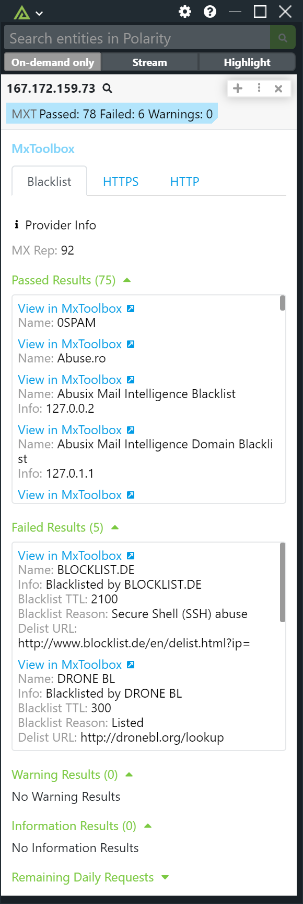

# Polarity MxToolbox Integration

MxToolbox is a web-based tool that provides a suite of free and paid network diagnostic and monitoring services.The platform provides comprehensive analysis and reports to help users identify and troubleshoot problems.

Polarity's MxToolbox integration allows automated queries of MxToolbox services using IP Addresses, URLs and Domains.

To learn more about MxToolbox, visit the [official website](https://mxtoolbox.com/).

## Using a free MxToolbox account

If you are using a free MxToolbox account you will need to disable IP and URL lookups under the "Manage Integration Data" option as free accounts only support `MX` and `Blacklist` lookups on domains.

## MxToolBox Integration Options

### MxToolBox API Token

The API Token associated with your MxToolBox account.

> If you are using a free MxToolBox account you will only be able to run `mx` and `blacklist` lookups on domains.  IP and URL lookups will return an error indicating that you have reached your lookup limit.

### Data Sources

Select the data sources you would like to use for the MxToolBox integration. If no data sources are selected, all data sources will be used. Below is a table of the data sources that are searched for each entity type:

| Entity Type | Data Sources           |
| ----------- | ---------------------- |
| domain      | mx, blacklist          |
| ip          | blacklist, http, https |
| url         | http, https            |

## Installation Instructions

Installation instructions for integrations are provided on the [PolarityIO GitHub Page](https://polarityio.github.io/).

## Polarity

Polarity is a memory-augmentation platform that improves and accelerates analyst decision making. For more information about the Polarity platform please see:

https://polarity.io/
